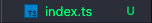

# 설치하기

### 1. [node.js 설치](https://nodejs.org/ko/)
- brew로 설치해도 상관 없음

---

### 2. 타입스크립트 설치

```zsh
npm install -g typescript
```
---

### 3. VSC로 TS를 작성할 폴더 열기


### 4.  .ts로 TS 파일 만들기



### 5. tsconfig.json 생성 후 내용 작성하기(컴파일 옵션)
```json
{   
  "compilerOptions" : {     
    "target": "es5",     //컴파일할 js 버전
    "module": "commonjs",  
  } 
}
```

### 6. 자바스크립트로 변환하기(자동 컴파일)
- 브라우저는 인식을 못함

```zsh
tsc -w
```
- ts파일이 있는 디렉토리에서 설정해야한다.
- ts파일을 자동으로 js 파일로 저장된다.


